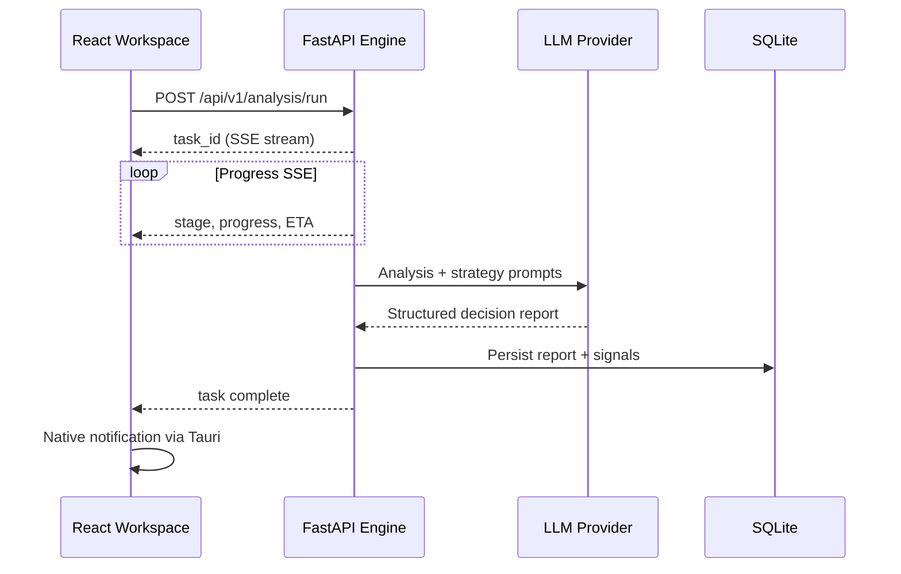

# AlphaDesk Architecture

> 阿尔法工作台 / 智策工作台 — Production desktop research workspace built on [daily_stock_analysis](https://github.com/ZhuLinsen/daily_stock_analysis).

## Overview

AlphaDesk is a **local-first** cross-platform desktop application that wraps the proven Python analysis engine in a Tauri v2 shell with a modern React workspace UI.

```
┌─────────────────────────────────────────────────────────────────────┐
│                     AlphaDesk Desktop Shell (Tauri v2)              │
│  ┌──────────────┐  ┌────────────────────────────────────────────┐  │
│  │ System Tray  │  │  React + TypeScript + Tailwind Workspace   │  │
│  │ Notifications│  │  • Watchlist  • Dashboard  • Agent Chat    │  │
│  │ Keychain     │  │  • Reports    • Backtest   • Settings       │  │
│  │ Auto-update  │  │  • Command Palette (⌘K)  • Onboarding       │  │
│  └──────────────┘  └──────────────────┬─────────────────────────┘  │
└───────────────────────────────────────┼─────────────────────────────┘
                                        │ HTTP / WebSocket (localhost)
┌───────────────────────────────────────▼─────────────────────────────┐
│              Python FastAPI Engine (Tauri Sidecar)                    │
│  api/ • src/ • strategies/ • data_provider/ • bot/                  │
│  ─ LLM routing (Ollama, DeepSeek, Claude, Gemini, Qwen, …)          │
│  ─ Multi-market data (A/H/US/JP/KR)                                 │
│  ─ Analysis pipeline, reports, backtest, portfolio, alerts          │
└───────────────────────────────────────┬─────────────────────────────┘
                                        │
┌───────────────────────────────────────▼─────────────────────────────┐
│  Local Storage: SQLite + encrypted secrets (OS keychain via Tauri)    │
└─────────────────────────────────────────────────────────────────────┘
```

## Layer Responsibilities

### 1. Tauri Shell (`apps/alphadesk/src-tauri/`)

| Module | Responsibility |
|--------|----------------|
| `sidecar.rs` | Spawn/stop Python engine, health checks, port allocation |
| `tray.rs` | System tray menu: Quick Analyze, Dashboard, Schedule toggle, Quit |
| `commands.rs` | IPC: secrets, notifications, file dialogs, export paths |
| `lib.rs` | Plugin registration, state management, window lifecycle |

**Why Tauri v2 over Electron?** Smaller bundles (~15–25 MB vs 150+ MB), native WebView, built-in updater, OS keychain integration, and first-class sidecar support.

### 2. React Workspace (`apps/alphadesk/src/`)

| Area | Key modules |
|------|-------------|
| Layout | Resizable multi-panel workspace, persisted layout state |
| i18n | Simplified Chinese primary, English secondary (`i18n/`) |
| API | Typed client mirroring `/api/v1/*` from upstream engine |
| Pages | Home, Chat, Reports, Backtest, Portfolio, Settings, Onboarding |
| Desktop | Tauri bridge hooks for tray actions, native notifications |

The UI intentionally elevates the upstream workspace tour pattern: fluid panel transitions, dense financial data presentation, and one-click export.

### 3. Python Engine (`engine/`)

Vendored from `daily_stock_analysis` with minimal patches:

- `alphadesk_entry.py` — desktop entry, data dir, port binding
- Existing `server.py` + `api/` — unchanged REST surface
- `strategies/` — 15+ agent strategies (均线、缠论、波浪、热点、事件、成长、预期…)

**Dev mode:** Tauri spawns `python engine/alphadesk_entry.py --port <dynamic>`.

**Release mode:** PyInstaller bundles `alphadesk-engine` binary as Tauri external binary sidecar.

## Data Flow: Daily Analysis



## Security Model

- API keys stored in OS keychain (Tauri `stronghold` / `keyring` plugin)
- Engine binds to `127.0.0.1` only
- Optional admin auth from upstream (`ADMIN_AUTH_ENABLED`)
- Legal disclaimers on every analysis surface

## Monetization Hooks

| Hook | Location |
|------|----------|
| License validation | `src-tauri/src/license.rs` (stub) |
| Feature gates | `src/lib/features.ts` |
| Premium strategies | Engine strategy registry + frontend gate |

## Build Targets

| Platform | Artifact |
|----------|----------|
| macOS | `.dmg` (universal or arch-specific) |
| Windows | `.msi` + `.exe` NSIS |
| Linux | `.AppImage`, `.deb` |

See [README.md](../README.md) for build instructions and [`.github/workflows/release.yml`](../.github/workflows/release.yml) for CI.